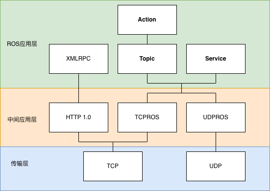
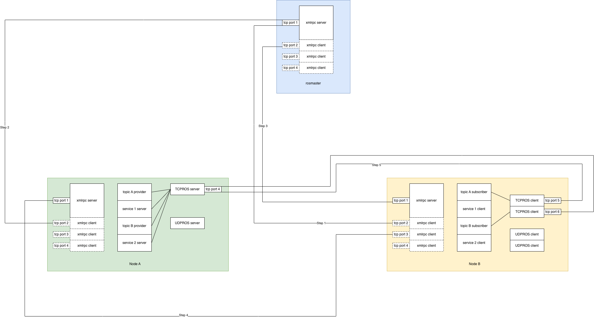

# ROS简介
ROS（Robot Operating System）虽然名字叫Operation System，但其实只是一个跑在Linux系统上的用户态应用（包含一些用户态程序，脚本和库），它的主要功能是为单一或多个机器上不同进程间提供了一些封装好的通信机制，在机器人应用软件开发这个领域提供一些更高级的抽象语义。具体来说，它提供了topic，service，以及action等通信机制，下面会更详细的解释它所提供的这些通信机制的工作原理，至于他们的使用方法则不是本文主要关注点，如果需要可以参见官方相关文档。下面的内容基本都是针对cpp版本的ros库，对于python或其他语言的ros库可能不适用。

# ROS中的角色
在介绍ROS提供的各种通信机制前需要说明的是，ROS不是一个去中心化的通信系统，在一个ROS应用中存在一个特殊的对象，它为整个系统的通信提供路由功能，这个特殊的对象被称为rosmaster。

# ROS提供的通信机制
ROS中传输的数据一种是业务数据（诸如电机转速，机器人运动方向等），另一种是关于如何建立业务数据传输通道的数据，称为元数据（比如topic的publier需要通过这种数据知道应该把数据发到哪去）。
前者所使用的通信机制包括上面提到的topic/service/action等，后者所使用的通信机制则是xmlrpc。这些通信机制在实现上的层级关系如下图所示


# ROS通信过程


	Topic通信过程
		1. Node B 启动并通过xmlrpc协议向rosmaster注册，声明自己需要topic A的消息，消息类型，自己的xmlrpc server地址
		2. Node A 启动并通过xmlrpc协议向rosmaster注册，声明自己发布topic A的消息，消息类型，自己的xmlrpc server地址
		3. rosmaster发现Node A和Node B的消息匹配，因此通过xmlrpc协议通知Node B有关Node A的信息
		4.1 Node B根据rosmaster发送的有关Node A的消息，通过xmlrpc协议向Node A请求建立数据通道
		4.2 Node A根据收到的Node B有关数据通道的信息，返回自己支持的TCPROS Server地址等信息
		5. Node B通过TCPROS协议向Node A提供的TCPROS server建立连接
		6. 连接建立后Node B将通过TCPROS协议，持续接收Node A发送的消息
	
	Service通信过程
		与topic类似，都是先通过xmlrpc协议沟通传输通道，然后建立tcpros传输通道，最后传输数据

	Action通信过程
		action只是上层封装的语法糖，底层完全复用topic机制。每个action的底层是5个固定命名规则的topic，client和server通过发布订阅这5 个话题实现action这种带反馈、可取消的长任务流程:
<div align="center">

|话题名|作用|
| -------- | -------- |
|/xxx/goal	|下发任务目标|
|/xxx/cancel|	发送取消指令|
|/xxx/status|	任务状态|
|/xxx/feedback| 任务进度反馈|
|/xxx/result|	任务最终结果|

</div>

	常见问题辨析:
		1. 每个node上只有一个xmlrpc server，它打开的这个tcp端口是持久的。不管是topic A还是topic B, service C, service D, action E, action F，建立数据传输通道的过程中都复用这个唯一的xmlrpc server进行数据接收和分发处理。

		2. 每个node上可能有多个xmlrpc client，它打开的tcp端口一般是临时的，一次xmlrpc协议request-response交互完成后连接就关闭了（xmlrpc所依赖的HTTP1.0协议本身不支持多次会话复用tcp连接），下次需要发送xmlrpc数据时再打开新的端口。

		3. xmlrpc协议只负责传输建立业务数据传输通道的数据（有点绕口是吧=_=），不传输topic/service/action本身任何业务数据。

		4. 每个node上只有一个TCPROS server，它打开的这个tcp端口是持久的。不管是topic A还是topic B, service C, service D, action E, action F，建立TCPROS数据传输通道时以及后续发送业务数据给所有topic subscriber, service client, action client时都复用这个唯一的TCPROS server（UDPROS同理）。

		5. 每个node上可能有多个TCPROS client，它打开的tcp端口一般是持久的，在topic/service/action数据传输的过程中一直复用。不同topic/service/action所使用的是不同的TCPROS client(tcp端口)。举例来说:
			topic A建立的tcp连接是192.168.1.100:1234 -> 192.168.1.101:5678
			topic B建立的tcp连接是192.168.1.100:2345 -> 192.168.1.101:5678
		这样在TCPROS server端才可以根据tcp连接的5元组（source_ip:source_port:tcp/udp协议类型:server_ip:server_port）区分出每条tcp连接到底是用于哪个业务的（topic A还是topic B）。更具体来解释，当Node A向Node B唯一的TCPROS server建立一个连接时，会在报文中声明自己是订阅的哪个topic,这样TCPROS server就知道对这条连接绑定它对应的topic的业务处理函数了。


# ROS数据序列化与反序列化
	基本可以直接理解为memcpy，和protobuf这种TLV结构化的并压缩过的序列化方式不同，兼容性差数据量大但是处理速度非常快。

# ROS定时器
	ROS所使用的timer背后是基于poll管理的Linux timerfd，并使用最小堆来管理计时器。具体来说，创建/删除/修改定时器后，堆顶始终是目前最近到期的计时器。ros计算堆顶计时器到期需要的时间，并通过linux timerfd进行计时，在ros的poll线程中检查该timerfd到期可读事件，当timerfd可读时（计时器到期），检查堆中所有到期时间小于（避免系统调度等因素导致计时器到期延迟而丢失）等于当前时间的计时器，并封装相应回调事件到callback queue中，等待其他线程从队列取出事件并执行计时器到期的业务回调函数。

	关于计时器的实现方案有很多，其他一些主流计时器实现方案简单介绍如下：

| 数据结构                 | 插入 (Add) | 删除 (Del) | 查找/触发 (Expire) | 代表框架                     | 核心工程特性与适用场景                                                        |
| -------------------- | -------- | -------- | -------------- | ------------------------ | ------------------------------------------------------------------ |
| 最小堆 (Min-Heap)       | O(logN)  | O(logN)  | O(1)           | ROS 1, libuv, Go Runtime | 通用性最强。堆顶永远是最近到期的任务，适合定时器数量在几百到几千级别，且到期时间跨度随机、分布极不均匀的场景。            |
| 多级时间轮 (Timing Wheel) | O(1)     | O(1)     | O(1)           | Netty, Kafka, Linux内核    | 极致的高并发吞吐。通过环形数组和指针步进，增删查均为常数时间。极其适合网络框架中海量、高频、生命周期（如连接超时、心跳）的任务调度。 |
| 红黑树 (Red-Black Tree) | O(log⁡N) | O(log⁡N) | O(log⁡N)       | Nginx, Linux hrtimer     | 内存紧凑，跨度适应性强。作为平衡二叉树，无论跨度是1毫秒还是10年都能完美适应。适合请求超时时间跨度大、且需要频繁动态增删的场景。  |
| 跳表 (Skip List)       | O(log⁡N) | O(log⁡N) | O(1)           | Redis, DPDK              | 并发友好，实现简单。在有序链表基础上加入多级索引，天然支持细粒度锁或无锁操作。适合需要高并发读写、且对实现复杂度要较低的场景。    |

# ROS线程模型
	ROS中的线程包括下面这些，当然用户可能自己创建有业务线程不在讨论范围内：
		1. 日志线程：接收其他线程发送的日志，并写入磁盘或转发
		2. xmlrpc线程：监听，接收xmlrpc消息，并执行相关回调，处理xmlrpc协议数据实现业务数据传输通道建立。
		3. poll线程：监听，接收tcpros/udpros协议底层的tcp/udp数据包，以及定时器timerfd的io事件，封装为回调消息放入callback queue（默认使用全局队列，除非用户指定了自定义队列）
		4. main线程：用户业务线程，执行用户业务代码并通过ros::spin()执行用户注册的ros各通信机制业务层回调函数（也可能通过MultiThreadedSpinner等方式在单独的多个线程中执行）
		5.（MultiThreadedSpinner等线程）：参见上面的说明，也可以在其他多个线程中并发执行ros各通信机制业务层回调函数

	可以看到默认情况下各通信机制的回调都在一个队列中，且可能在单一线程中串行执行，因此如果某个具体业务的callback比较耗时，则可能影响其他callback的执行，因此实现业务callback和选择ros callback执行方式时需要注意。另外如选择多线程执行，需要注意callback间的race condition，保证线程安全。
	
	另外需要注意的是，topic publisher/service client/action client发送数据的线程是调用对应发送方法的线程，如果多个线程并发发送则需要在每个线程中创建它对应的publisher/client对象以便建立新的tcpros连接，不能多个线程共用相同的publisher/client对象以免数据冲突（简单来说，publish/call/sendGoal不是线程安全的）。


```

# Reference

[https://wiki.ros.org/ROS/Technical%20Overview](https://wiki.ros.org/ROS/Technical%20Overview)